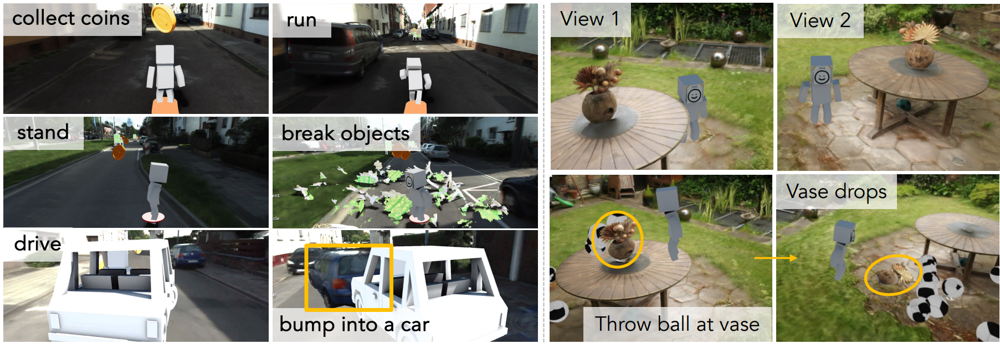

<h1>Video2Game</h1>

<div style="text-align: center;"><h1>Video2Game: Real-time, Interactive, Realistic and Browser-Compatible Environment from a Single Video</h1></div>

<div style="text-align: center;">
<a href="https://xiahongchi.github.io">Hongchi Xia<sup>1,2</sup></a>,
<a href="https://zhihao-lin.github.io/">Zhi-Hao Lin<sup>1</sup></a>,
<a href="https://people.csail.mit.edu/weichium/">Wei-Chiu Ma<sup>3</sup></a>,
<a href="https://shenlong.web.illinois.edu/">Shenlong Wang<sup>1</sup></a>
</div>
<br>
<div style="text-align: center;">
<sup>1</sup>University of Illinois Urbana-Champaign, 
<sup>2</sup>Shanghai Jiao Tong University,
<sup>3</sup>Cornell University
</div>
<br>
<div style="text-align: center;">
CVPR 2024
</div>



## Progress
- [x] NeRF Module
- [x] Mesh Extraction and Post-Processing
- [x] Baking Pretrain Module
- [x] Collision Model Generation
- [ ] Result Preview
- [x] Evaluation Code
- [ ] Baking Finetune Module
- [ ] GPT-4 Query


## Enviornment
TO-DO

## Dataset
* KITTI-360
Please refer to the structure in `datasets/kitti360.py:L250`

* COLMAP Format
We deal with colmap format dataset which composes of the following:
```
Root
 ├── sparse/0/             
 ├── images/    
 ├── normal/
 ├── depth/      
 ├── instance/
```

* VR-NeRF
TODO

## Usage
Video2Game is composed of many submodules. We'll introduce the usage of our code one-by-one.

### Generating Priors
#### Geometry Priors
We use normal and depth priors generated from [Omnidata](https://github.com/EPFL-VILAB/omnidata/tree/main/omnidata_tools/torch). 

Please follow their conda environment settings and copy `priors/depth_prior.py` and `priors/normal_prior.py` to `omnidata_tools/torch` in the subdirectory of omnidata.

For the commands to generate priors, please refer to `scripts/priors/depth_prior.sh` and `scripts/priors/normal_prior.sh` in this repo.
#### Semantic Priors
* KITTI-360
We use semantic labels in KITTI-360 scene generated from [mmsegmentation](https://github.com/open-mmlab/mmsegmentation). 

Please copy our sample code `priors/kitti_semantic.py` to the root directory of mmsegmentation and generate labels.

* Gardenvase
We use instance labels to denote the vase and background. The labels can be generated from any segmentation tools.

They are stored in `.npy` format. You can refer to `datasets/colmap.py:L244,L331` for details.


### NeRF Training
Please refer to scripts in `scripts/nerf/`. 

#### Training options
* --normal_mono activate normal prior
* --depth_mono activate depth prior
* --render_semantic activate semantic/instance MLP learning

### Mesh Extraction from NeRF
Please refer to scripts in `scripts/extract_mesh/`. 

### Baking Pretraining
Please refer to scripts in `scripts/baking/`. 

### Collision Model Generation
For convex collision models, [V-HACD](https://github.com/kmammou/v-hacd) is required for convex decomposition.
For trimesh collision models, [Bounding-mesh](https://github.com/gaschler/bounding-mesh) is required for convex decomposition.

Please refer to scripts in `scripts/collisions/`. 

### Pipeline summary
Take gardenvase scene as an example:

1. generate geometry priors and semantic labels if neccessary
2. train nerf: `scripts/nerf/garden_trainall.sh`
3. extract mesh from nerf: `scripts/extract_mesh/extract_mesh_garden.sh`
4. baking: `scripts/baking/garden_baking_pretrain.sh` and `scripts/baking/garden_baking_pretrain_export.sh`
5. collision model generation: `scripts/collisions/collisions_convex.sh`

### Evaluation
Please refer to scripts in `scripts/eval/`.

## Contact
Contact [Hongchi Xia](mailto:xiahongchi@sjtu.edu.cn) if you have any further questions. 

## Acknowledgments
Our codebase builds heavily on [ngp-pl](https://github.com/kwea123/ngp_pl) and [nerf2mesh](https://github.com/ashawkey/nerf2mesh). Thanks for open-sourcing!.

## Game Development
Please refer to our live demo at [Project Page](https://video2game.github.io/).

Basically, based on the textured mesh, the MLP shader and the generated collision models, one can design one's own game in three.js following our example demo.  